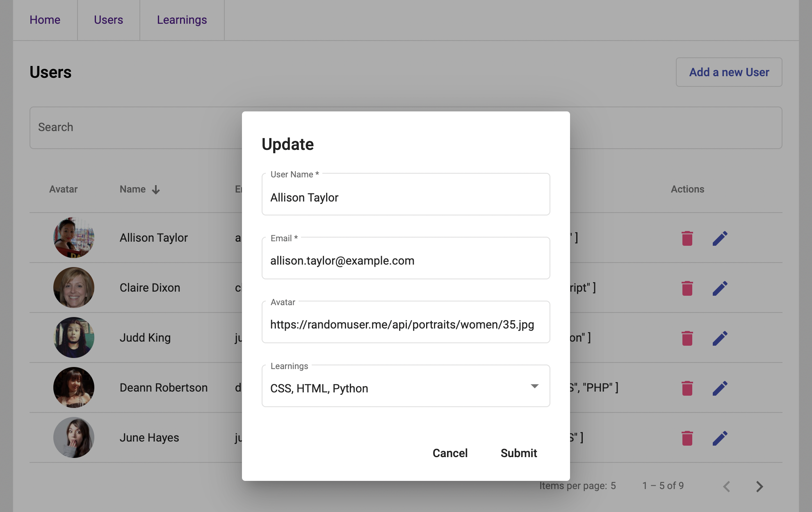

# TestApp

## API

Run `npm run api` to load a fake backend.
## Development server

Run `npm run start` for a dev server. Navigate to `http://localhost:4200/`. The app will automatically reload if you change any of the source files.
## Running unit tests

Run `npm run test` to execute the unit tests via [Karma](https://karma-runner.github.io).